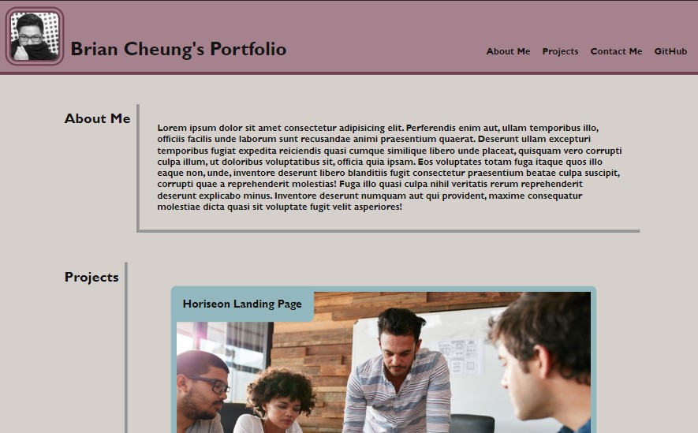
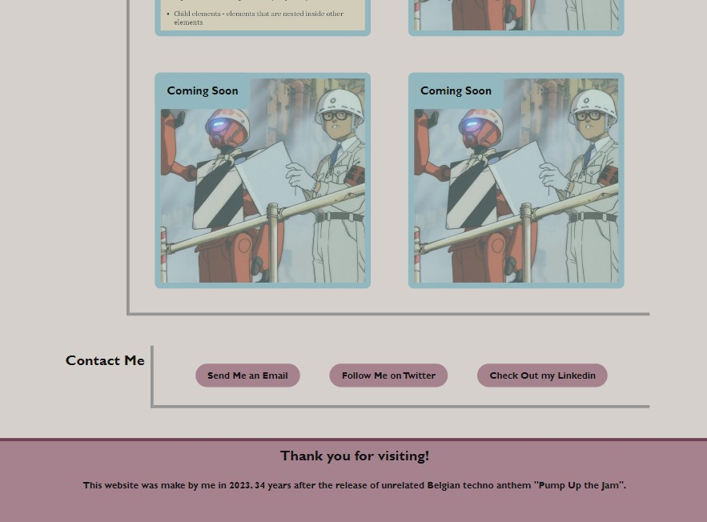

# WEEKLY CHALLENGE 2 - PROFRESSIONAL PORTFOLIO - ADVANCE CSS

## Table of Contents
- [Description](#Description)
- [Features](#features)
- [Deployment](#Deployment)
- [Screenshots](#Screenshots)
- [Usage](#Usage)
- [Test](#Test)
- [Screenshots](#screenshots)
- [Issues](#Issues)
- [Links](#Links)
- [Credits](#Credits)

## Description
This project is a portfolio website showcasing my skills and work samples, designed to make it easier for potential employers to evaluate my capabilities. It allows emlpoyers to view my past projects, learn more about me, and easily contact me. NOTE: To ensure my privacy, I did not actually include my email or links to my socials in the "Contact Me" section. Clicking on those buttons will only 1. open you preferred email client, 2. the corresponding social media site.

## Features
- Navigation tabs that scroll to their corresponding sections.
- Clickable application images that redirect to deployed applications.
- Responsive layout for various screen sizes and devices.
- Visual feedback when hovering over links and buttons.

## Deployment
Simply click on the provided URL in the "Links" section to access the refactored website.
No dependencies and requirements.

## Screenshots

## Usage
- Clicking on any of the navigation tabs will let you jump to the corresponding section of the website.
- Clicking on any images of deployed applications will redirect you to the application in a new tab.
- Clicking on any of the button in the "About Me" section will either open you preferred email client to compose a message, or navigate to the corresponding third party websites in a new tab.

## Test
Conducted Lighthouse test to assess performance, accessibility, best practices, and SEO. Download link to test results here >>> [Lighthouse Test Results](Assets/Lightouse-Test/Lighthouse-Test.html)

## Issues
- .card placmenet is a little wonky when resizing the actual browser. No such issue occurs when viewed using responsive dimensions function via device toolbar. Therefore, exact width cannot be determined and issue cannot be remedied with media queries. With that said, the website functions normally with no issues when viewed on present dimensions set up by the inspect tool or with responsive dimensions.

## Links
[Access My Site Here]()

[Access My GitHub Here]()

## Credits
Xpert Learning Assistant

[CSS Tricks - A Complete Guide to Flexbox](https://css-tricks.com/snippets/css/a-guide-to-flexbox/#aa-background)

[MDN - display](https://developer.mozilla.org/en-US/docs/Web/CSS/display)

[MDN - Using media queries](https://developer.mozilla.org/en-US/docs/Web/CSS/CSS_media_queries/Using_media_queries)

[MDN - Pseudo-classes](https://developer.mozilla.org/en-US/docs/Web/CSS/Pseudo-classes)

[MDN - Pseudo-elements](https://developer.mozilla.org/en-US/docs/Web/CSS/Pseudo-elements)

[MDN - CSS flexible box layout](https://developer.mozilla.org/en-US/docs/Web/CSS/CSS_Flexible_Box_Layout)

[W3 Schools - CSS The object-fit Property](https://www.w3schools.com/css/css3_object-fit.asp)

[Coolors - Color Pallete Generator](https://coolors.co/)

[Medium - Designing with Curves: Why Rounded Edges are Becoming a Must in Web Design](https://bootcamp.uxdesign.cc/designing-with-curves-why-rounded-edges-are-becoming-a-must-in-web-design-937e69d24ca4)

[Medium - 7 UI UX Design Mistakes You Should Avoid In 2023](https://medium.com/@uidesign0005/7-common-design-mistakes-b07dea46a4c4)
